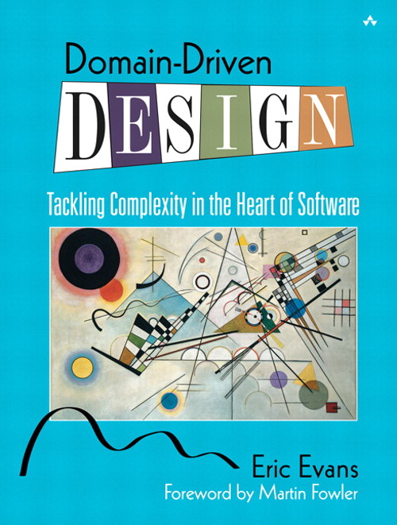
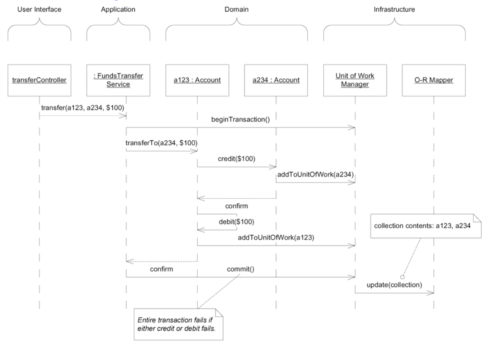

# Use Domain Driven Design-lite

DDD (Domain Driven Design) is a popular design methodology used across many development teams. It
helps developers and domain experts collaborate through shared language resulting in an application
that fits the domain problem well enough to gracefully handle many iterations.

While it is a great methodology to use when designing any application, following the tenants of DDD
can come at a high cost. Therefore, it is best used in areas of high complexity. Are the
applications DE needs to develop complex and novel enough to warrant full DDD treatment. If not full
treatment, then what parts of DDD should be used.

## Sponsors

- Alex Finnarn - DE Front-end Developer - alexander.finnarn@cu.edu

## Status

- **Under Review** - This record is under review for acceptance. The DE (Digital Engagement) team
  has not used a specific development design philosophy in the past so each new idea needs some time
  to gauge effectiveness.

## Prior Art

Within Advancement and the NextGen project, some team members have expressed "domains" but more in
the sense of "bounded contexts" vs. the full DDD treatment adhering to exercises and terminology.
Currently, there are no examples of DE or Central Advancement participating in DDD.

DDD came to fruition circa 2003 originally credited to Eric Evans and his book of the same name.
Evans worked a lot with software design and placed a lot of emphasis on domain modeling throughout
his work. The book is quite lengthy, and DDD continues to bloom with new ideas up to the current
times.

After Evans' book debuted, event sourcing and CQRS (Command Query Resource Separation) became
popular, and to this day, many senior developers employ DDD in their daily work. Plenty of people
have written about how and when you should use DDD in your projects, or if you should use a
different methodology instead.

References:

- Eric Evans' original book
  - https://www.amazon.com/Domain-Driven-Design-Tackling-Complexity-Software/dp/0321125215
- Article with "DDD scorecard" - https://www.informit.com/articles/article.aspx?p=1944876

## Current Context

We currently have no guideposts for general application design other than we "use agile
methodologies". Knowing when and where to use a popular design methodology, DDD, will help us
further define standards we will use for the CMS migration as well as future application
development.

## Decision

We will use a limited set of terminology and methodologies relating to DDD in the CMS migration;
however, we won't adhere to most of what's discussed in the original book. The following key ideas
will be adopted:

- **Ubiquitous Language -** Collaborate with end-users of the CMS and other Advancement apps to
  develop a common glossary of terms aligning code with what the business does. Everyone involved in
  the project uses this common language in order to discuss requirements and feature development.
- **Bounded Context -** Each application domain will focus on one main context. If the app is too
  large to cover one domain, keep splitting it up until the business problem the app solves is clear
  and focused to one concern. Often times, you will take into account actual job titles and
  organizational boundaries since the key stakeholders change as you move around the different
  concerns.
- **Being the User -** Domain experts and application developers have open lines of communication
  with little help from proxies. Ad hoc meetings with these domain experts are favored over standing
  status update meetings. Developers actually work through the application as the end-user and know
  all the user requests, support tickets, and complaints that end-users report.
- **Event Storming -** Developers and domain experts meet to list out all the events that happen in
  the context of their jobs and the application at hand being developed. Each event is grouped into
  generic categories to look for duplicates and, more importantly, events that don't fit into the
  known domain model.

## Consequences

The `github-docs` repo needs updating in the following places before the ADR can be accepted:

- https://github.com/CUCentralAdvancement/github-docs#development-philosophies-and-workflows
- That section should have some docs on dev workflow which is also mentioned
  in https://github.com/CUCentralAdvancement/github-docs/issues/22

## Detailed Explanation

On 03/16/2021 there was a meeting entitled "Donation Data/Reporting Architecture Review"
where a developer, Alex Finnarn, gave a presentation entitled
"Is There Even Anything Here To Model?: DDD Within DE". The following notes are a rough transcript
of that presentation.

---

### Is There Even Anything Here To Model?: DDD Within DE

DDD might not be worth it's time.



### What Is A Model?

> "A model is a **simplification**. It is an interpretation of reality that
> **abstracts** the aspects relevant to solving the problem at hand and
> **ignores extraneous details.**"
> - Eric Evans: Domain Driven Design, Chapter 1

Notice how there are no discussions of infrastructure, UIs, databases, etc. in that statement. In
the book, they start out with an example designing process circuit boards.


That's how simple the model started: two boxes with a line denoting a relationship. Of course, via
more discussions with engineers the model grew to be more complex.


I have no idea what that graphic is describing, but even without infrastructure, I think it's clear
to see that developing an application for process circuit board design is a complicated enough
domain to warrant full DDD adherence for that project.

### Where Does The Model Go?


Evans talks about layered architecture and how the model fits into the "domain" layer, hence the
term domain-driven design. Evans also use the term "model-driven design" a lot, and we can combine
them into simply "domain model" when distinguishing that code from other more generic code and the
infrastructure that runs it.



Evans then goes on to describe a real-world example of layered architecture in banking transactions.
The crux of the operation rests in the transaction process and the more generic parts of storing and
displaying data can be tucked into the background.

### Where is the CMS Domain Model Work?


To me, Ruby on Rails (or a similar framework) covers all the domain problems relating to users
logging in, editing forms, and seeing the data appear on the frontend. Rails is 17 years old and has
quite a few different ways of accomplishing most any CMS need.


However, at the edge of the CMS domain sits orders, and that's where I think some domain modeling
work can exist, if any place. That's why I propose keeping the CMS separate from a "
processing/reporting"
application so that the CMS can be as generic as possible and cover needs for rending content
outside of giving.cu.edu for the foundation.cu.edu or essential.cu.edu domains.

```ruby
class Faq < ApplicationRecord
end

class Fund < ApplicationRecord
end

class Page < ApplicationRecord
end
```

To illustrate this point, I went ahead and scaffolded out the three current models in the giving
site:
FAQs, Funds, and Pages. There is code that all models shared, and when I moved that to the "
Application"
layer, I was left with no domain model logic at all. Of course, over time the logic will grow, but I
think any domain model...outside of Rails gems and conventions...would have shown itself in the
initial scaffolding of resources.

### Smart UI As A Contrast

Evans contrasts DDD with "Smart UIs" where the logic is tied to the view layer. For example, you
have a form on the Giving site that updates someones record data. The controller for that form can
handle all the logic and events emanating from the form submission. You don't need Value Objects,
Aggregates, Event Sourcing, and all the other DDD jargon just to build an app for that simple use
case.

Similarly, we have a CMS that simply takes user input and updates the database. We don't need to
complicate matters with heavy-handed design. Rails and similar rapid application development
frameworks include all the necessary deign patterns leaving us to develop an engaging UX that drives
up donations.

    “Put all the business logic into the user interface. Chop the application into small functions
    and implement them as separate user interfaces, embedding the business rules into them. Use a
    relational database as a shared repository of the data. Use the most automated UI building and
    visual programming tools available.” - Eric Evans: Domain Driven Design, Chapter 4

### How To Refactor?

Once you're done exhausting conventions and contributed solutions, what do you do? You'll likely not
have achieved 100% feature requirement needs. Evans says to focus on three things as you refine your
design and architecture.

1. Live in the domain.
1. Keep looking at things a different way.
1. Maintain an unbroken dialogue with domain experts.

...or else you'll keep building and rebuilding the "wrong" features.

The key is to keep talking about the process with the people who will use the application instead of
only talking within the dev team and across the bow to project managers.

### Final Recommendations

I ended with some bullet points re-iterating the points made above but also specifically saying that
I thought CMS project differed from processing/reporting and that the two concerns should have
bounded contexts.

- Be the user.
- Use conventions.
- Don't try too much DDD contrasting that with a "Smart UI" approach.
- Use ubiquitous language, bounded context, and event storming concepts.
- Don't combine the CMS and reporting/processing concerns. One concern will supposedly be deprecated
  in a year. Sensitive data. Pairs to Advancement job titles as well.
- Keep the CMS as simple and conventional as possible. Complexity always grows over time.


